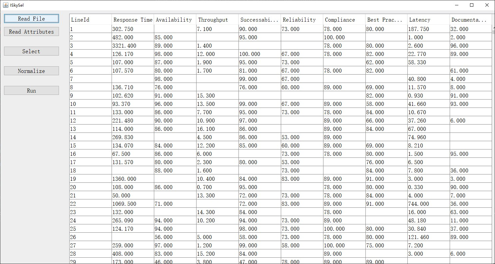
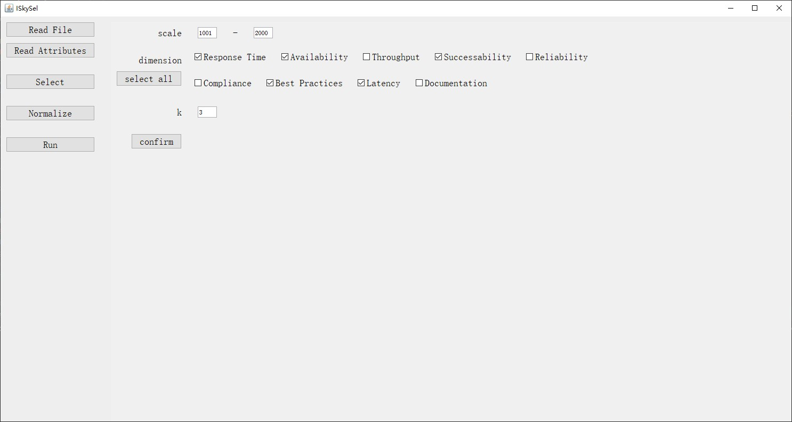
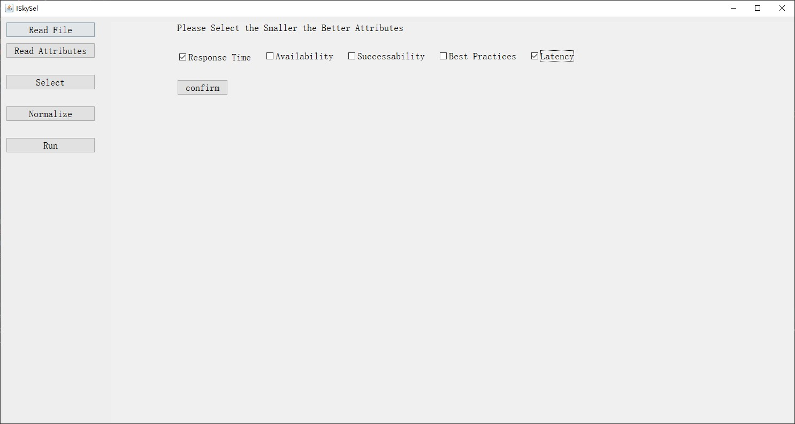
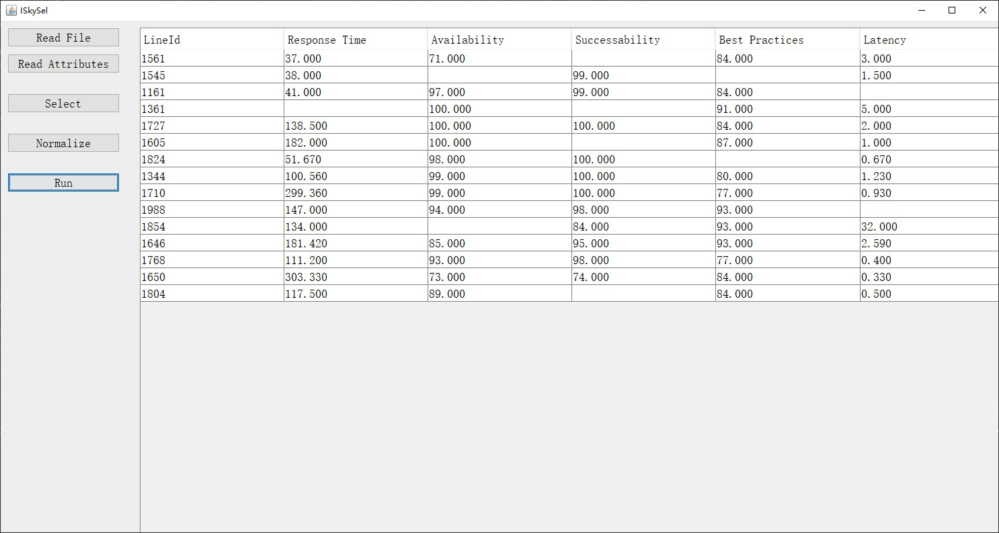

## Description
This repository matains the **Java implementation** of QoS-centric service recommendation on the incomplete QoS dataset.

You can read more information about the algorithm from our publication:

1. Yanjun Shu,  Jianhang Zhang, Wei Emma Zhang, Decheng Zuo, and Quan Z. Sheng. "IQSrec: An Efficient and Diversified Skyline Services Recommendation on Incomplete QoS", manuscript for TSC. 

## Dependencies

* Java 1.8 (<https://www.oracle.com/>)

## Usage

  We provide two ways to use IQSRec: (1) use java instance (2) gui tool

### Instance

 The library implements Dimension-based Partition, MSPC and IQSRec algorithms for incomplete datasets. You can get the usage in `UsageDemo.java`.
  
### GUI Start

run `GUIStart.java`

#### First. Read Origin Dataset

Be attention, the format of input should be like in the 'data/qws_rate_0.2.txt' (separated by space or ',')
#### Next. Select Data
In this step, you can select the dimensions and services you're interested. 

#### And. Normalize Data
By default, all QoS attributes that larger is better. So we need to know which attributes are smaller is better.
As the figure shown, "Response Time" and "Latency" should be selected.

#### Finally. Run
Click "Run", you can get the result.

## FeedBack
If you find any bugs or errors, please post to our issue page.

